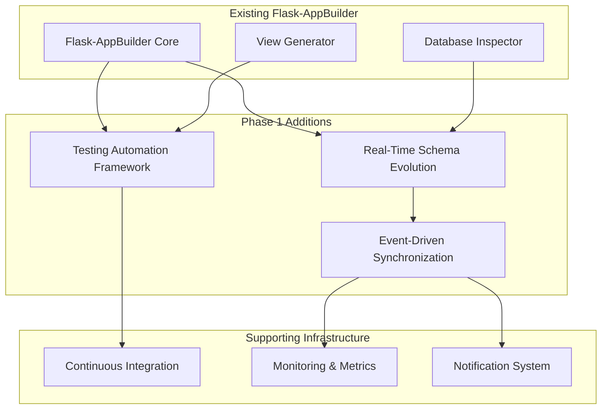
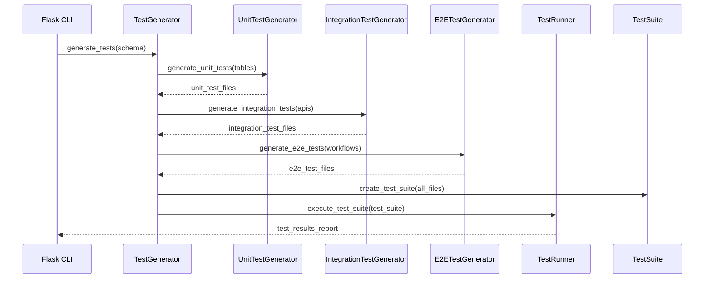
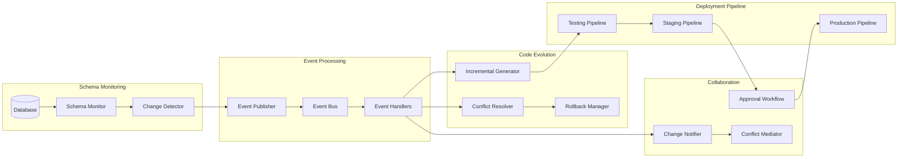

# Phase 1 Architecture: Foundation Systems
*Testing Automation Framework & Real-Time Schema Evolution*

## 🏗️ Overall Phase 1 Architecture

### System Overview
Phase 1 establishes the foundational capabilities that enable all future enhancements. The architecture follows a modular, event-driven design that integrates seamlessly with the existing Flask-AppBuilder framework.



---

# 🧪 Testing Automation Framework

## Architecture Design

### Core Components
```python
TestingFramework/
├── core/
│   ├── __init__.py
│   ├── test_generator.py              # Master test orchestrator
│   ├── test_runner.py                 # Test execution engine  
│   ├── test_reporter.py               # Results and metrics
│   └── config.py                      # Configuration management
├── generators/
│   ├── __init__.py
│   ├── base_generator.py              # Abstract base generator
│   ├── unit_test_generator.py         # Model and view unit tests
│   ├── integration_test_generator.py  # API integration tests
│   ├── e2e_test_generator.py         # End-to-end workflow tests
│   ├── performance_test_generator.py  # Load and stress tests
│   ├── security_test_generator.py     # Security validation tests
│   └── accessibility_test_generator.py # A11y compliance tests
├── data/
│   ├── __init__.py
│   ├── realistic_data_generator.py    # AI-powered test data
│   ├── edge_case_generator.py         # Boundary condition testing
│   ├── relationship_data_generator.py # Relational integrity data
│   └── performance_data_generator.py  # Load testing datasets
├── templates/
│   ├── unit_tests/
│   │   ├── model_test.py.j2           # Model test template
│   │   ├── view_test.py.j2            # View test template
│   │   └── api_test.py.j2             # API test template
│   ├── integration_tests/
│   │   ├── rest_api_test.py.j2        # REST API integration
│   │   ├── database_test.py.j2        # Database integration
│   │   └── service_test.py.j2         # Service integration
│   ├── e2e_tests/
│   │   ├── workflow_test.py.j2        # User workflow tests
│   │   ├── master_detail_test.py.j2   # Master-detail form tests
│   │   └── relationship_test.py.j2    # Relationship navigation
│   └── performance_tests/
│       ├── load_test.py.j2            # Load testing
│       └── stress_test.py.j2          # Stress testing
├── runners/
│   ├── __init__.py
│   ├── pytest_runner.py              # pytest execution
│   ├── playwright_runner.py          # E2E test execution
│   ├── locust_runner.py              # Performance test execution
│   └── security_runner.py            # Security test execution
└── reporting/
    ├── __init__.py
    ├── coverage_analyzer.py          # Test coverage analysis
    ├── quality_metrics.py            # Code quality metrics
    ├── performance_analyzer.py       # Performance benchmarking
    └── dashboard_generator.py        # Interactive reporting dashboard
```

### Data Flow Architecture


### Configuration System
```python
@dataclass
class TestGenerationConfig:
    """Comprehensive test generation configuration."""
    
    # Test Types
    generate_unit_tests: bool = True
    generate_integration_tests: bool = True
    generate_e2e_tests: bool = True
    generate_performance_tests: bool = True
    generate_security_tests: bool = True
    generate_accessibility_tests: bool = True
    
    # Test Coverage
    target_coverage_percentage: int = 95
    include_edge_cases: bool = True
    include_error_scenarios: bool = True
    include_boundary_tests: bool = True
    
    # Data Generation
    realistic_test_data: bool = True
    test_data_variety: str = 'high'  # low, medium, high
    preserve_referential_integrity: bool = True
    include_performance_datasets: bool = True
    
    # Test Execution
    parallel_execution: bool = True
    max_test_workers: int = 4
    test_timeout_seconds: int = 300
    retry_failed_tests: bool = True
    
    # Reporting
    generate_html_reports: bool = True
    generate_junit_xml: bool = True
    generate_coverage_reports: bool = True
    generate_performance_reports: bool = True
    
    # Integration
    ci_cd_integration: bool = True
    webhook_notifications: bool = True
    slack_integration: bool = False
    email_notifications: bool = False
    
    # Advanced Options
    ai_powered_test_generation: bool = False  # Future enhancement
    visual_regression_testing: bool = False   # Phase 2
    chaos_engineering_tests: bool = False     # Phase 2
```

---

# 🔄 Real-Time Schema Evolution

## Architecture Design

### Core Components
```python
SchemaEvolution/
├── core/
│   ├── __init__.py
│   ├── evolution_engine.py           # Main orchestration engine
│   ├── change_coordinator.py         # Change coordination
│   └── evolution_config.py           # Configuration management
├── monitoring/
│   ├── __init__.py
│   ├── database_monitor.py           # Real-time schema monitoring
│   ├── change_detector.py            # Schema diff analysis
│   ├── event_publisher.py            # Change event broadcasting
│   └── schema_snapshot.py            # Schema state management
├── evolution/
│   ├── __init__.py
│   ├── incremental_generator.py      # Update existing code
│   ├── migration_generator.py        # Database migration scripts
│   ├── conflict_resolver.py          # Handle breaking changes
│   ├── rollback_manager.py           # Safe rollback capabilities
│   └── impact_analyzer.py            # Change impact assessment
├── deployment/
│   ├── __init__.py
│   ├── continuous_deployer.py        # Automated deployment pipeline
│   ├── testing_pipeline.py           # Automated testing of changes
│   ├── staging_manager.py            # Staging environment management
│   └── production_gateway.py         # Production deployment controls
├── collaboration/
│   ├── __init__.py
│   ├── change_notifier.py            # Team notifications
│   ├── approval_workflow.py          # Change approval process
│   ├── conflict_mediator.py          # Team conflict resolution
│   └── change_historian.py           # Change history tracking
└── integration/
    ├── __init__.py
    ├── git_integration.py            # Version control integration
    ├── ci_cd_integration.py          # CI/CD pipeline integration
    ├── slack_integration.py          # Slack notifications
    └── webhook_manager.py            # Webhook management
```

### Event-Driven Architecture


### Schema Change Types
```python
from enum import Enum
from dataclasses import dataclass
from typing import List, Dict, Any, Optional

class SchemaChangeType(Enum):
    """Types of schema changes."""
    TABLE_ADDED = "table_added"
    TABLE_REMOVED = "table_removed"
    TABLE_RENAMED = "table_renamed"
    COLUMN_ADDED = "column_added"
    COLUMN_REMOVED = "column_removed"
    COLUMN_MODIFIED = "column_modified"
    COLUMN_RENAMED = "column_renamed"
    CONSTRAINT_ADDED = "constraint_added"
    CONSTRAINT_REMOVED = "constraint_removed"
    INDEX_ADDED = "index_added"
    INDEX_REMOVED = "index_removed"
    RELATIONSHIP_ADDED = "relationship_added"
    RELATIONSHIP_REMOVED = "relationship_removed"
    RELATIONSHIP_MODIFIED = "relationship_modified"

@dataclass
class SchemaChange:
    """Represents a schema change event."""
    change_id: str
    change_type: SchemaChangeType
    timestamp: datetime
    table_name: str
    column_name: Optional[str] = None
    old_definition: Optional[Dict[str, Any]] = None
    new_definition: Optional[Dict[str, Any]] = None
    impact_severity: str = 'medium'  # low, medium, high, breaking
    backward_compatible: bool = True
    requires_approval: bool = False
    rollback_plan: Optional[str] = None
    
    # Relationships
    affected_tables: List[str] = None
    affected_relationships: List[str] = None
    
    # Metadata
    detected_by: str = 'auto'  # auto, manual
    source_system: str = 'database'
    change_description: str = ''
    migration_script: Optional[str] = None
    
    def __post_init__(self):
        if self.affected_tables is None:
            self.affected_tables = []
        if self.affected_relationships is None:
            self.affected_relationships = []
```

---

# 🔧 Implementation Standards

## Code Quality Standards

### Python Standards
```python
# Type Hints - Required for all functions
def generate_test_suite(schema: DatabaseSchema, config: TestGenerationConfig) -> TestSuite:
    """Generate comprehensive test suite with proper typing."""
    pass

# Error Handling - Comprehensive exception handling
class TestGenerationError(Exception):
    """Base exception for test generation errors."""
    pass

class SchemaAnalysisError(TestGenerationError):
    """Error during schema analysis."""
    pass

class TestTemplateError(TestGenerationError):
    """Error in test template processing."""
    pass

# Logging - Structured logging throughout
logger = logging.getLogger(__name__)

def analyze_schema(schema: DatabaseSchema) -> SchemaAnalysis:
    logger.info("Starting schema analysis", extra={
        "schema_name": schema.name,
        "table_count": len(schema.tables)
    })
    try:
        analysis = perform_analysis(schema)
        logger.info("Schema analysis completed successfully")
        return analysis
    except Exception as e:
        logger.error("Schema analysis failed", extra={
            "error": str(e),
            "schema_name": schema.name
        })
        raise SchemaAnalysisError(f"Failed to analyze schema: {e}")
```

### Testing Standards
```python
# Unit Tests - 100% coverage requirement
class TestUnitTestGenerator(unittest.TestCase):
    """Test suite for unit test generator."""
    
    def setUp(self):
        self.generator = UnitTestGenerator()
        self.sample_schema = create_sample_schema()
    
    def test_generate_model_tests_creates_all_test_types(self):
        """Test that all model test types are generated."""
        tests = self.generator.generate_model_tests(self.sample_schema.tables[0])
        self.assertIn('test_create', tests)
        self.assertIn('test_read', tests)
        self.assertIn('test_update', tests)
        self.assertIn('test_delete', tests)
    
    def test_generate_model_tests_handles_edge_cases(self):
        """Test edge case handling in model test generation."""
        # Test with empty table
        empty_table = TableInfo(name="empty", columns=[])
        with self.assertRaises(TestGenerationError):
            self.generator.generate_model_tests(empty_table)

# Integration Tests - Required for all components
class TestTestingFrameworkIntegration(unittest.TestCase):
    """Integration tests for the complete testing framework."""
    
    def test_end_to_end_test_generation_pipeline(self):
        """Test complete pipeline from schema to generated tests."""
        # This tests the entire flow
        pass

# Performance Tests - Required for critical paths
class TestPerformanceCriticalPaths(unittest.TestCase):
    """Performance tests for critical code paths."""
    
    def test_large_schema_generation_performance(self):
        """Test performance with large database schemas."""
        large_schema = create_large_test_schema(tables=100, columns_per_table=20)
        start_time = time.time()
        
        test_suite = generate_complete_test_suite(large_schema)
        
        generation_time = time.time() - start_time
        self.assertLess(generation_time, 30.0, "Generation took too long")
        self.assertGreater(len(test_suite.tests), 1000, "Not enough tests generated")
```

### Documentation Standards
```python
class TestGenerator:
    """
    Master test generation orchestrator for Flask-AppBuilder applications.
    
    This class coordinates the generation of comprehensive test suites including
    unit tests, integration tests, end-to-end tests, performance tests, and
    security tests based on database schema analysis.
    
    Features:
        - Automatic test type detection based on schema complexity
        - Intelligent test data generation with realistic scenarios
        - Performance benchmark generation for scalability testing
        - Security vulnerability testing with OWASP compliance
        - Master-detail relationship testing for complex forms
        
    Usage:
        >>> generator = TestGenerator(config=TestGenerationConfig())
        >>> schema = analyze_database_schema("postgresql://...")
        >>> test_suite = generator.generate_complete_test_suite(schema)
        >>> test_results = generator.execute_test_suite(test_suite)
        
    Args:
        config (TestGenerationConfig): Configuration for test generation
        inspector (EnhancedDatabaseInspector): Database analysis engine
        
    Attributes:
        generators (Dict[str, BaseTestGenerator]): Individual test generators
        test_runner (TestRunner): Test execution engine
        reporter (TestReporter): Results and metrics reporting
    """
    
    def generate_complete_test_suite(self, schema: DatabaseSchema) -> TestSuite:
        """
        Generate comprehensive test coverage for entire application.
        
        Analyzes the database schema and generates appropriate test types
        based on complexity, relationships, and data patterns. Automatically
        includes edge cases, error scenarios, and performance benchmarks.
        
        Args:
            schema (DatabaseSchema): Analyzed database schema
            
        Returns:
            TestSuite: Complete test suite with all generated tests
            
        Raises:
            TestGenerationError: When test generation fails
            SchemaAnalysisError: When schema analysis is invalid
            
        Performance:
            Typical generation time: 30-60 seconds for 50-table schema
            Memory usage: 100-500MB during generation
            
        Examples:
            >>> schema = DatabaseSchema.from_uri("sqlite:///app.db")
            >>> test_suite = generator.generate_complete_test_suite(schema)
            >>> print(f"Generated {len(test_suite.tests)} tests")
            Generated 847 tests
        """
        pass
```

---

# 🛠️ Development Infrastructure

## Project Structure
```
flask-appbuilder-evolution/
├── src/
│   ├── flask_appbuilder/              # Existing FAB code
│   │   ├── cli/
│   │   │   └── generators/            # Enhanced generators
│   │   └── ...
│   ├── testing_framework/             # Phase 1.1: Testing system
│   ├── schema_evolution/              # Phase 1.2: Evolution system
│   └── ...
├── tests/
│   ├── unit/                          # Unit tests
│   ├── integration/                   # Integration tests
│   ├── e2e/                          # End-to-end tests
│   └── performance/                   # Performance tests
├── docs/
│   ├── architecture/                  # Architecture documentation
│   ├── api/                          # API documentation
│   ├── tutorials/                    # User tutorials
│   └── examples/                     # Example applications
├── examples/
│   ├── phase1_demo/                  # Phase 1 demonstration
│   ├── testing_showcase/             # Testing framework examples
│   └── evolution_demo/               # Schema evolution examples
├── infrastructure/
│   ├── docker/                       # Docker configurations
│   ├── kubernetes/                   # K8s deployments
│   ├── terraform/                    # Infrastructure as code
│   └── monitoring/                   # Monitoring configurations
└── tools/
    ├── ci_cd/                        # CI/CD scripts
    ├── deployment/                   # Deployment automation
    └── development/                  # Development tools
```

## CI/CD Pipeline
```yaml
# .github/workflows/phase1_pipeline.yml
name: Phase 1 Development Pipeline

on:
  push:
    branches: [ main, develop, 'feature/**' ]
  pull_request:
    branches: [ main, develop ]

jobs:
  test:
    runs-on: ubuntu-latest
    strategy:
      matrix:
        python-version: [3.8, 3.9, '3.10', '3.11']
        database: [sqlite, postgresql, mysql]
    
    steps:
    - uses: actions/checkout@v3
    
    - name: Set up Python ${{ matrix.python-version }}
      uses: actions/setup-python@v3
      with:
        python-version: ${{ matrix.python-version }}
    
    - name: Install dependencies
      run: |
        python -m pip install --upgrade pip
        pip install -r requirements/development.txt
    
    - name: Run unit tests
      run: |
        pytest tests/unit/ -v --cov=src --cov-report=xml
    
    - name: Run integration tests
      run: |
        pytest tests/integration/ -v --database=${{ matrix.database }}
    
    - name: Run generated test validation
      run: |
        python tools/test_generation_validator.py
    
    - name: Upload coverage
      uses: codecov/codecov-action@v3
      with:
        file: ./coverage.xml
  
  security:
    runs-on: ubuntu-latest
    steps:
    - uses: actions/checkout@v3
    - name: Run security scan
      run: |
        pip install bandit safety
        bandit -r src/
        safety check
  
  performance:
    runs-on: ubuntu-latest
    if: github.event_name == 'pull_request'
    steps:
    - uses: actions/checkout@v3
    - name: Performance benchmarks
      run: |
        python tools/benchmark_test_generation.py
        python tools/benchmark_schema_evolution.py
  
  deploy_staging:
    needs: [test, security]
    runs-on: ubuntu-latest
    if: github.ref == 'refs/heads/develop'
    steps:
    - name: Deploy to staging
      run: |
        python tools/deploy_staging.py
```

This Phase 1 architecture provides the detailed technical foundation for implementing the Testing Automation Framework and Real-Time Schema Evolution system. Next, I'll begin the actual implementation of these systems.